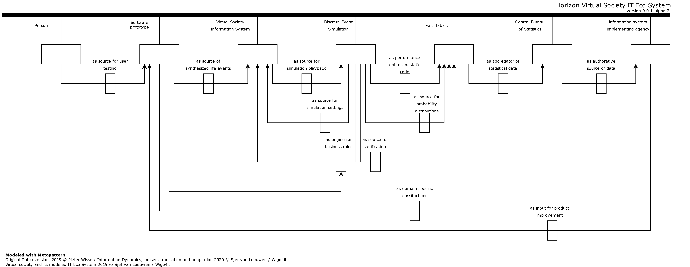
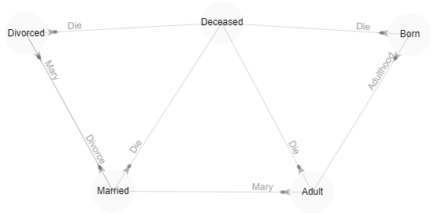

# Virtual Society Simulation

## What is it?

Virtual Society is an aid in order to test software using life-like simulations. Primarily Virtual Society is being developed 
for designers within software engineering and data science. Virtual Society offers simulations within a chain of automated
systems, through providing these systems with life events. These events are modelled within the simulation and executes these.
Examples of these life events are births and deaths, leaving the parental home, starting a family, etc.
It is crucial to note that this information is completely fabricated: it is synthetic data generated by the simulation.

Since Virtual Society generates data through its simulations, data cannot be traced back to real personal information.
The upside of using synthetic data is that the privacy of citizens is not affected. On top of this, synthetic data is much
more accessible for a broader audience.
Simulations are a replication (digital twin) of reality. Simulation is a dynamic and complex process. Through Virtual Society
we achieve the aforementioned based on life events. This simulation model determines through the use of rules derived from
algorithms how the simulation progresses.


## Horizon Eco System

The followin Metapattern depicts positioning of virtual society in its eco system.


## Status

Currently being set up...

## Components

The following open source components are used for simulations

### Sim# (SimSharp) [](https://ci.appveyor.com/project/abeham/simsharp/branch/master)
A .NET port and extension of SimPy, process-based discrete event simulation framework
<br/>

https://github.com/abeham/SimSharp
### Stateless [](https://ci.appveyor.com/project/DotnetStateMachine/stateless/branch/master) [](https://www.nuget.org/packages/stateless) [](https://gitter.im/dotnet-state-machine/stateless?utm_source=badge&utm_medium=badge&utm_campaign=pr-badge&utm_content=badge) [](http://stackoverflow.com/questions/tagged/stateless-state-machine)

Create *state machines* and lightweight *state machine-based workflows* directly in .NET code:
<br/>
https://github.com/dotnet-state-machine/stateless/blob/dev/README.md


Stateless is mainly used for state integrity of simulated objects.

```csharp
public PersonState(LifeEvents initialState) : base(initialState)
{
    Machine.Configure(LifeEvents.Born)
        .Permit(LifeEventsTriggers.Die, LifeEvents.Deceased)
        .Permit(LifeEventsTriggers.Adulthood, LifeEvents.Adult);
    Machine.Configure(LifeEvents.Adult)
        .Permit(LifeEventsTriggers.Die, LifeEvents.Deceased)
        .Permit(LifeEventsTriggers.Mary, LifeEvents.Married);
    Machine.Configure(LifeEvents.Married)
        .Permit(LifeEventsTriggers.Die, LifeEvents.Deceased)
        .Permit(LifeEventsTriggers.Divorce, LifeEvents.Divorced);
    Machine.Configure(LifeEvents.Divorced)
        .Permit(LifeEventsTriggers.Die, LifeEvents.Deceased)
        .Permit(LifeEventsTriggers.Mary, LifeEvents.Married);
    Machine.Activate();
}
```


Stateless is extended so the states and triggers / flow can be easily visualized in Force Directed Graphs using force graph.

### force-graph [![NPM package][npm-img]][npm-url] [![Build Size][build-size-img]][build-size-url] [![Dependencies][dependencies-img]][dependencies-url]
Force-directed graph rendered on HTML5 canvas.
<br/>
https://github.com/vasturiano/force-graph

[npm-img]: https://img.shields.io/npm/v/force-graph.svg
[npm-url]: https://npmjs.org/package/force-graph
[build-size-img]: https://img.shields.io/bundlephobia/minzip/force-graph.svg
[build-size-url]: https://bundlephobia.com/result?p=force-graph
[dependencies-img]: https://img.shields.io/david/vasturiano/force-graph.svg
[dependencies-url]: https://david-dm.org/vasturiano/force-graph

### Math .NET  [](https://ci.appveyor.com/project/cdrnet/mathnet-numerics)  
Math.NET Numerics is the numerical foundation of the Math.NET initiative, aiming to provide methods and algorithms for numerical computations in science, engineering and every day use. Covered topics include special functions, linear algebra, probability models, random numbers, statistics, interpolation, integration, regression, curve fitting, integral transforms (FFT) and more.
<br />
https://github.com/mathnet/mathnet-numerics

### Deedle [](https://www.nuget.org/packages/Deedle/)
Deedle implements an efficient and robust frame and series data structures for manipulating with structured data. It supports handling of missing values, aggregations, grouping, joining, statistical functions and more. For frames and series with ordered indices (such as time series), automatic alignment is also available.

<br/>

### AdminLTE for Blazor [](https://www.nuget.org/packages/Blazorized.AdminLte/) [](https://github.com/sjefvanleeuwen/blazor-adminlte/actions)
ADMINLTE for Blazor is a collection of reusable components, with which you can easily develop digital services as a designer or developer. Think of buttons, form elements and page templates. This project adapts ADMINLTE 3 so the components can be used from dotnet core Blazor.
<br />
https://github.com/sjefvanleeuwen/blazor-adminlte

### AdminLTE for Blazor Plugins
Plugins integration project for Blazorized AdminLte, contains external blazorized components such as BlazorTable for AdminLte. ADMINLTE for Blazor is a collection of reusable components, with which you can easily develop digital services as a designer or developer. Think of buttons, form elements and page templates. This project uses Blazorized ADMINLTE 3 so the plugins are tested against the ADMINLTE layouts and interactions.
<br />
https://github.com/sjefvanleeuwen/blazorized-adminlte-plugins
