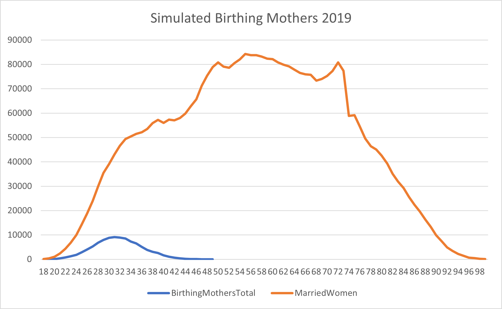
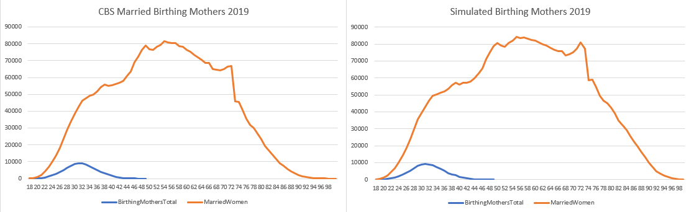
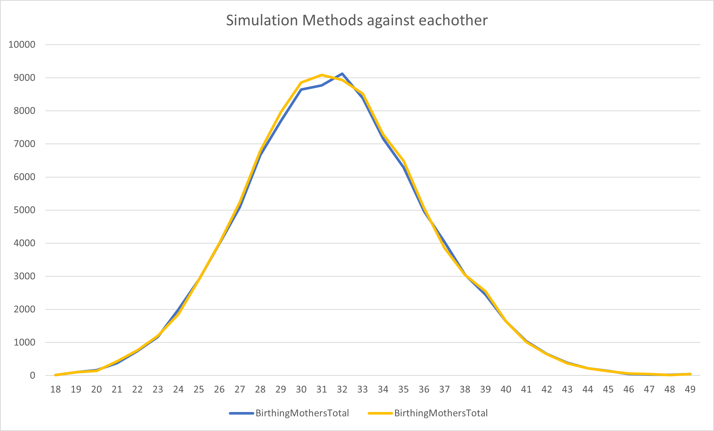

# Children Probability

## What is that?

Under children probability we understand the chance that a married couple will be having children.
We made the decision to first start assigning children to married couples in this test to see if our probabilities
for married couples would work.

## How is it decided?

[Levend geboren kinderen; leeftijd moeder, volgorde geboorte uit de moeder
](https://opendata.cbs.nl/statline/#/CBS/nl/dataset/37744ned/table?ts=1606373167688): From this table we took the ages of the
mothers when they gave birth in that year and their marital status. In here, partnerships are included under the marital status
married. 

We subtracted the amount of married people with the amount of birthing mother ages. This way we had 2 weights, those who have children
and those who do not have them.

## What data is used?

[Levend geboren kinderen; leeftijd moeder, volgorde geboorte uit de moeder
](https://opendata.cbs.nl/statline/#/CBS/nl/dataset/37744ned/table?ts=1606373167688): We used this table to get the amount of
mothers who give birth at a certain age in 2019.

[Bevolking; geslacht, leeftijd en burgerlijke staat, 1 januari
](https://opendata.cbs.nl/statline/?dl=308BE#/CBS/nl/dataset/7461bev/table): In this table we took
all the women with the married marital status. We subtracted the birthing mothers from the actual
married women population.

## Graph Simulated Data


In the graph above you can see that when a couple gets married they do not immeadiatly begin with children.
There are a few exceptions and that is the blue line birthing mothers. The little hop in the
late ages of a womens fertitlity years is because after 49 we do not have any more induvidual data
per age group. So in 49 women above that age are also included.

## Is the data similar?


As you can see the two graphs are almost spot on the same, they have the same shape and peaks.
From these two images where left is the data from CBS and the right one is our own generated data,
we can concluded that they are very similar.

### Code showecase

```csharp

for (int i = 0; i < 32; i++) 
            {
                childChoice = new List<double>();
                int age = i + 18;
                for (int j = 0; j < womenAges[i]; j++)
                {
                    weights = MotherData.GetColumn<double>(Convert.ToString(age)).Values.Select(c => Convert.ToDouble(c)).ToList();
                    Children.WeightGetChildren = weights;
                    childChoice.Add(env.RandChoice(Children.SourceGetChildren, Children.WeightGetChildren));
                }

                var children = childChoice.Where(p => p == 1).Count();
                childAmount = new List<double>();

                for (int j = 0; j < children; j++)
                {
                    childAmount.Add(env.RandChoice(Children.SourceAmountChildren, Children.WeightsAmountChildren));
                }

                //Here they are getting sorted and added to a new collection
                collectionNew.Add(new ChildrenProbability()
                {
                    Age = age,
                    WomenNoChildren = childChoice.Where(p => p == 0).Count(),
                    MotherOfOneAgeFirstBorn = childAmount.Where(p => p == 1).Count(),
                    MotherOfTwoAgeFirtBorn = childAmount.Where(p => p == 2).Count(),
                    MotherOfThreeAgeFirstBorn = childAmount.Where(p => p == 3).Count(),
                    BirthingMothersTotal = children
                }) ;
                
            }

```

First we made a list 'childChoice' to test the weights if they will be having children or not.
These weights can be found in the file [motherbirthing_ages](./data/motherbirthing_ages.csv).
After the decision for every mother who has been assigned 1, which means that they will have children.
For them it will be decided how many children they get.

### Was there another way of doing this?



In the graph above the yellow line represent the results of the current showcased code. The blue line
represent the previous method, the reason we chose to go for the code that made the yellow line
is because this way it can work over the simulated marital ages.

As the child probability is based on the status of married women it is important that we work
on the simulated amount of married women from our "maritalAgeProbability" class. Where as
the code for the blue line had nothing to do with the married women.

The way we have done it know shows our different results are able to work great together
and that we can still get realisic results out of it.