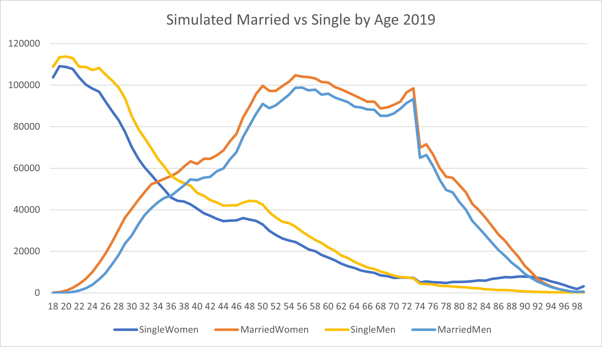
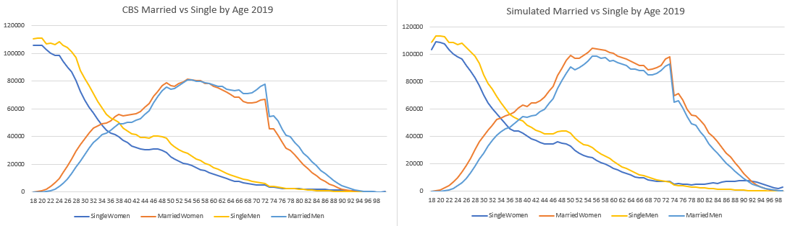

# Marital Age Probability

## What is that?

Under Marital Age probability we speak of the age when a person decides to
perform a life event such as marrying. When a person is of age they have the right
to decide to marry. 

## How is it decided?

We have gatherd the information about the ages, genders and marital status of the
citizens in The Netherlands from CBS. With this data we made a construction to take
those weights for marital status on ages, with the current age list of citizens we have.
In this age list we have the current amount of citizens and the current ages available in
it.

## What data was used?

[Bevolking; geslacht, leeftijd en burgerlijke staat, 1 januari
](https://opendata.cbs.nl/statline/?dl=308BE#/CBS/nl/dataset/7461bev/table):
From this table we found the information we used for the weights. In this table we can find
the Marital Status and the age. Unfortunately we did not find the data for registerd Partnerships,
so we left it out in this.

[Prognose bevolking; geslacht en leeftijd, 2020-2060
](https://opendata.cbs.nl/statline/#/CBS/nl/dataset/84646NED/table?ts=1605714142946):
From this table we used the age calculations of the citizens during the year 2020. This is
the list of generated citizens in the code.

## Graph Simulated Data


In the Graph above you can see that the peak age in the simulated data is around 54 years old.
You can also see that the amount of single woman is at it's highest the minute they turn
18 years old. This is because most teenagers don't decide to marry at a young age.

In this graph there is also 'missing' information. This is because we decided
that one first has to become married before they divorce or become a widow/widower. In
this graph the only thing you see is when they decide to tie the knot.

### Is the data similar?



In the left table you can find the graph of the data we found on the site of CBS.
The data in here is the data that we used as our weight list to see if 
someone would marry or not. The right one show the data made by the simulation.

As you can see the graphs are almost identical in form. The only difference is
that because we only took the status of being married or being single, the graph contains
people who originally belong under the status of divorcé/dicorcée or widow/widower.

### Code Showcase
```csharp
for (int i = 18; i < 100; i++) 
            {
                womenList.Add(i, new List<PartnerType>());
                menList.Add(i, new List<PartnerType>());

                for (int j = 0; j < femaleAge[i]; j++) 
                {
                    weights = frame.GetColumn<double>(Convert.ToString(i)).Values.Select(c => Convert.ToDouble(c)).Skip(2).Take(2).ToList();
                    MaritalStatus.Weights = weights;
                    womenList[i].Add(env.RandChoice(MaritalStatus.Source, MaritalStatus.Weights));
                }

                for (int j = 0; j < maleAge[i]; j++) 
                {
                    weights = frame.GetColumn<double>(Convert.ToString(i)).Values.Select(c => Convert.ToDouble(c)).Take(2).ToList();
                    MaritalStatus.Weights = weights;
                    menList[i].Add(env.RandChoice(MaritalStatus.Source, MaritalStatus.Weights));
                }

                collection.Add(new MaritalAgeProbability()
                {
                    SingleWomen = womenList[i].Where(p => p == PartnerType.Single).Count(),
                    MarriedWomen = womenList[i].Where(p => p == PartnerType.Married).Count(),
                    SingleMen = menList[i].Where(p => p == PartnerType.Single).Count(),
                    MarriedMen = menList[i].Where(p => p == PartnerType.Married).Count(),
                    Age = i
                });
            }
```

In the code above you can see that we started with a for loop, we did this because
we knew that we were only after the data of age 18 to 99, as that were the ages we had data for.
Continuing, you can see that we added a new "List(PartnerType)" to womenList and menList,
because these 2 values are dictionaries.

You can see that are 2 different loops within the bigger for loops. This is so that
we could loop through the ages in both the male and female age list. As both of them have
different amounts of people in it.

At the end you can see that we start to split the data up and count them. We count the amount
of women who are either married or still single and the same goes for the men. Once this has
happend for all ages we exported the collection into a CSV file and with the
results in that file we made the Graphs you have seen earlier.