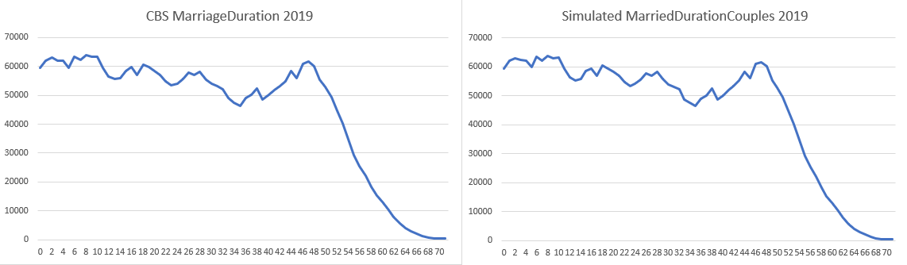

# Marital Duration

## What is it?

Marital Duration is the amount of time the married couple stays with eachother.

## How is the duration decided?
In the file [huwelijksduur_Excel](https://github.com/virtualsociety/simulation/blob/master/doc/Research/Huwelijksduur_Excel.xlsm)
you can see the different type of durations during a marriage. We took the data from 1998 and then we took
the diagonal data, so that we could see how long it takes for married couples from a specific year how long
they would stay together.

## What data is used?

We used the following table provided by the CBS with the data of how many couples celebrate their
marriage anniversary. We took the data of the couples that celebrated their anniversary in 2019.
[Bestaande huwelijken naar huwelijksduur, 1 januari](https://opendata.cbs.nl/#/CBS/nl/dataset/37492/table?dl=29174)


## Graph simulated data


We used the data to determine how long couples stay married. It does not show for each year how many couples
remain being married, it shows just the duration of the marriage of each married couple. That explains
the huge decrease later in the years. 

You can see that alot of marriages stop after 53 years or longer. This is due to the fact that
at this point in their lifes it is only a matter of fact before they meet their ends.

## Is the data similar?


On the left side you can see the data graph made with CBS data. While on the right side you can see the simulated data
As you can see the form of the 2 graphs are very similar, the only big difference is the amount of people used
in the simulation.

We ran this code under 1 million different couples where in reality there are multiple couples who undergo this
duration. We do not know wheter the data used by CBS contains registerd partnerships as we have not found any
data where the duration of a partnership is mentioned.
asd

## Code Showcase


```csharp
for (int i = 0; i < 1000000; i++) 
            {
                coupleList.Add(env.RandChoice(MaritalDuration.DurationSource, MaritalDuration.DurationWeights));
            }

            for (double i = 1; i < 72; i++) {
                collection.Add(new MaritalDurationPropability()
                {
                    Duration = i,
                    MarriedCouples = coupleList.Where(d => d == i).Count()
                });
            }
```

In the code above you can see that the couples are decided on a random choice using the weights on the duration.
These weights were found in the collected data. After that they get counted and sorted into the
collection list so that the data can be exported to a CSV file.