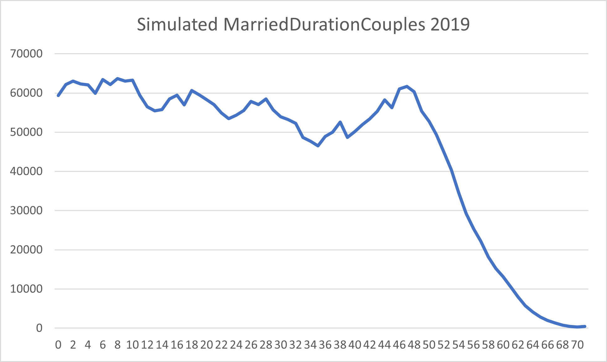

# Marital Duration

## What is it?

Marital Duration is the amount of time the married couple stays with eachother.

## How is the duration decided?
In the file [huwelijksduur_Excel](https://github.com/virtualsociety/simulation/blob/master/doc/Research/Huwelijksduur_Excel.xlsm)
you can see the different type of durations during a marriage. We took the data from 1998 and then we took
the diagonal data, so that we could see how long it takes for married couples from a specific year how long
they would stay together.

## What data is used?

We used the following table provided by the CBS with the data of how many couples are still married
and for what amount of time they are married per year.
[Bestaande huwelijken naar huwelijksduur, 1 januari](https://opendata.cbs.nl/statline/#/CBS/nl/dataset/37492/table?ts=1604302253141)


## Graph simulated data



We used the data to determine how long couples stay married. It does not show for each year how many couples
remain being married, it shows just the duration of the marriage of each married couple. That explains
the huge leap in the amount of people later in the years.

## Code Showcase


```csharp
for (int i = 0; i < 10000; i++) 
            {
                coupleList.Add(env.RandChoice(MaritalDuration.DurationSource, MaritalDuration.DurationWeights));
            }

            for (double i = 1; i < 21; i++) {
                collection.Add(new MaritalDurationPropability()
                {
                    Duration = i,
                    MarriedCouples = coupleList.Where(d => d == i).Count()
                });
            }
```

In the code above you can see that the couples are decided on a random choice using the weights on the duration.
These weights were found in the collected data. After that they get counted and sorted into the
collection list so that the data can be exported to a CSV file.