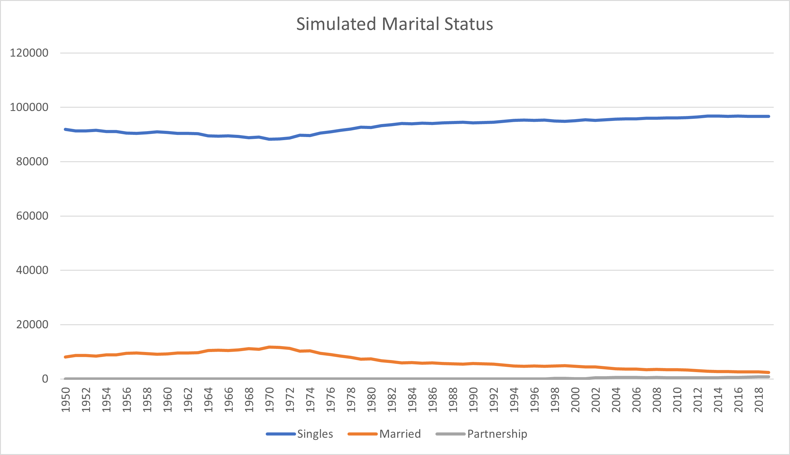
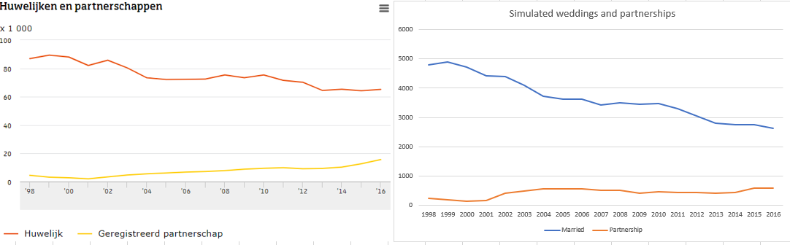

# Marital Status

## What is Marital Status?

A person is qualified to have a marital status when they are over the legal age of 18. 
Under marital status we have 3 distinct categories. A person can be single, married or in a registerd partnership.
A person can never have more than 1 status. 


## How is the Marital Status chosen?

With information provided by the goverment about the numbers of people being wed in the past 70 years,
we decide to put those numbers in a weight list and have a RandChoice function run over the weight list
and the source list. We have three different weight list variables. We have the total unwedded citiznes
that are over the age of 18, the total of citizens that chose to wed per year and lastly we have the total
of citizens that chose to register for partnership.

## What data was used?
The follwoing tables were used to provide data for our variables.

[Bevolking; kerncijfers](https://opendata.cbs.nl/statline#/CBS/nl/dataset/37296ned/table?ts=1603696652876)
: From this table we used the amount of unwed citizens over the past years. We used the total amount of
unwed citizens and deducted the children under the age of 18, as they were under the legal age of
marriage.

[Huwen en partnerschapsregistraties; kerncijfers](https://opendata.cbs.nl/statline/?dl=1FD20#/CBS/nl/dataset/37772ned/table)
: From this table we used the amount of registrated weddings and partnership and multiplied them by two.
Because in this table all the data shown in this table is the amounts of weddings and partnerships that took place,
not the amount of citizens that were getting married or are registering for a partnerships.

## Graph Simulated data



As you can see most citizens that are simulated are single. This is because a huge amount of people are most liekly
already in a relationship but have not chosen to register for a partnership. This data is soley based on the amount
of people that marry and/or get registrated for a partnersip per year.

There are more people married than shown in the graph because in this graph it shows whom decides to marry and/or
register for a partnership that year.

### Is the created data similar?

Source left table: [CBS](https://www.cbs.nl/nl-nl/nieuws/2017/34/geregistreerd-partnerschap-wint-aan-populariteit)

On the left table we see a graph made by the CBS who provided information on such details as the numbers of people in the country,
as well as how many people marry per year and register for partnerships. The table on the left is created
using the raw data CBS has on marriage and partnerships. 

On the right table titeld "Simulated weddings and partnerships", the data used to make this graph is
all created by the simulator. The data used for it was all provided on CBS. As you can see the two
graphs shown look very similar. A big difference is that the data does not show the same amount of
citizens who married or registerd for partnership, because we used 10000 citizens as our testing variable.

The similarities are mostly seen in the way the graphs is formed. You can see that after 2001 in both graphs
the popularitiy increased in getting a registerd partnership. While marriage in both the graps is marriage
is decreasing at almost the same rate. 

From looking at these tables we can concluded that the marital_status is very much trustworthy and 
does not contain data that makes in unrealistic to the facts from CBS.

### Code showcase
```csharp
for (int j = 1950; j < 2020; j++)
            { 
                var people = new List<PartnerType>();
                weights = frame.GetColumn<double>(Convert.ToString(j)).Values.Select(c => Convert.ToDouble(c)).Take(3).ToList();
                MaritalStatus.Weights = weights;
                for (int i = 0; i < 100000; i++)
                {
                    people.Add(env.RandChoice(MaritalStatus.Source, MaritalStatus.Weights));
                }
                collection.Add(new MaritalStatusPropability()
                {
                    Singles = people.Where(p => p == PartnerType.Single).Count(),
                    Married = people.Where(p => p == PartnerType.Married).Count(),
                    Partnership = people.Where(p => p == PartnerType.Partnership).Count(),
                    Year = j
                });
            }
```

As you can see above we started with creating a list where we would put our simulated citizens in.
After that we decide the weights by pulling the out of our CSV file and that for every year until 2020.
Once the weigths are defined we start adding people in a for loop that gets looped for the 70 years of
data provided. After every person has been decided the data is put in a collection that gets converted
into a CSV file, that gets exported.

