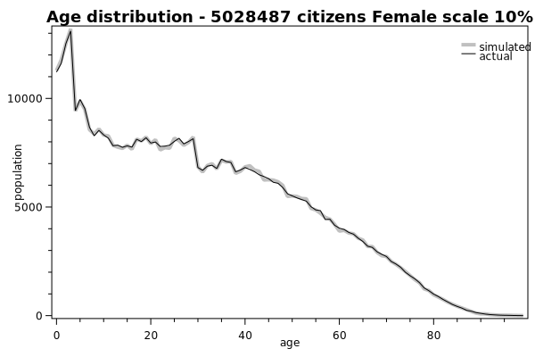
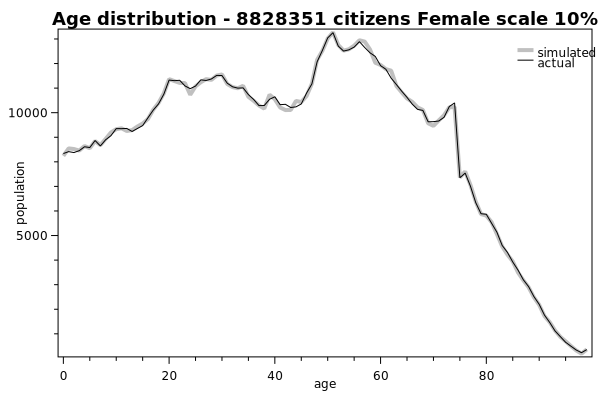
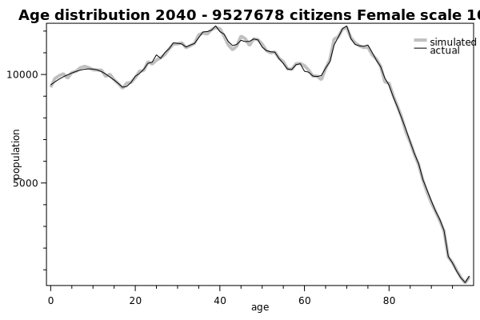

# Test project

As part of the virtual society tool set. This test project has currently 2 goals:

* Unit Testing code with assertions
* Theory testing on actuals (source data) v.s. estimates (probabilities) data generating charts for visual inspection

## Theory Testing

Consider the following test:

```csharp
[Theory]
[InlineData(0.1, 1950, 1950, Constants.idx_gender_male)]
[InlineData(0.1, 1950, 1950, Constants.idx_gender_female)]
[InlineData(0.1, 2021, 2021, Constants.idx_gender_male)]
[InlineData(0.1, 2021, 2021, Constants.idx_gender_female)]
[InlineData(0.1, 2040, 2040, Constants.idx_gender_male)]
[InlineData(0.1, 2040, 2040, Constants.idx_gender_female)]
public void DefaultTest(float scale, int startYear, int endYear, int gender)
{
 ...
}
```
### Inline Data

The theory creates charts and exports point data for each chart. The behavior of what is exported is controlled by a number of parameters.

#### Scale

In the source data totals of populations are counted and reported in the chart. When generating synthetic data 
through the weighted distribution list, we can opt to choose a scale. For example a scale of 0.1 will generate 
10% of the actual population number. This allows us to export smaller data sets.

#### Start Year


#### End Year
#### Gender


### Exporting

When exporting theories 3 files are created for each theory.

1. The graph showing simulated versus actual in scalable vector graphic (.svg) format
2. The X,Y Point data from the simulation in comma delimited (.csv) format
3. The X,Y Point data from the actuals in comma delimited (.csv) format

The file names are built up as follows:

./`UnitTestClassName`/`TestMethodName`-`Year`-`NumberOfPeople`-scale-`ScaleFactor`-`SimulatedOrActual`.`Extension`

i.e: consider the following theory set to export 1950, 2021 and a year 2040 projection of the populution.

```
Folder PATH listing
./bin/debug/netcoreapp3.1
\---AgeTests
        AgeDistribution-1950-4998226-Male-scale-0.1-actual.csv
        AgeDistribution-1950-4998226-Male-scale-0.1-simulated.csv
        AgeDistribution-1950-4998226-Male-scale-0.1.svg
        AgeDistribution-1950-5028487-Female-scale-0.1-actual.csv
        AgeDistribution-1950-5028487-Female-scale-0.1-simulated.csv
        AgeDistribution-1950-5028487-Female-scale-0.1.svg
        AgeDistribution-2021-8721864-Male-scale-0.1-actual.csv
        AgeDistribution-2021-8721864-Male-scale-0.1-simulated.csv
        AgeDistribution-2021-8721864-Male-scale-0.1.svg
        AgeDistribution-2021-8828351-Female-scale-0.1-actual.csv
        AgeDistribution-2021-8828351-Female-scale-0.1-simulated.csv
        AgeDistribution-2021-8828351-Female-scale-0.1.svg
        AgeDistribution-2040-9508557-Male-scale-0.1-actual.csv
        AgeDistribution-2040-9508557-Male-scale-0.1-simulated.csv
        AgeDistribution-2040-9508557-Male-scale-0.1.svg
        AgeDistribution-2040-9527678-Female-scale-0.1-actual.csv
        AgeDistribution-2040-9527678-Female-scale-0.1-simulated.csv
        AgeDistribution-2040-9527678-Female-scale-0.1.svg

```

#### SVG Output Examples

Some examples from what the theory test produces:





To inspect the point data you can open a example CSV from this [location](./testing/age-output-example/)
